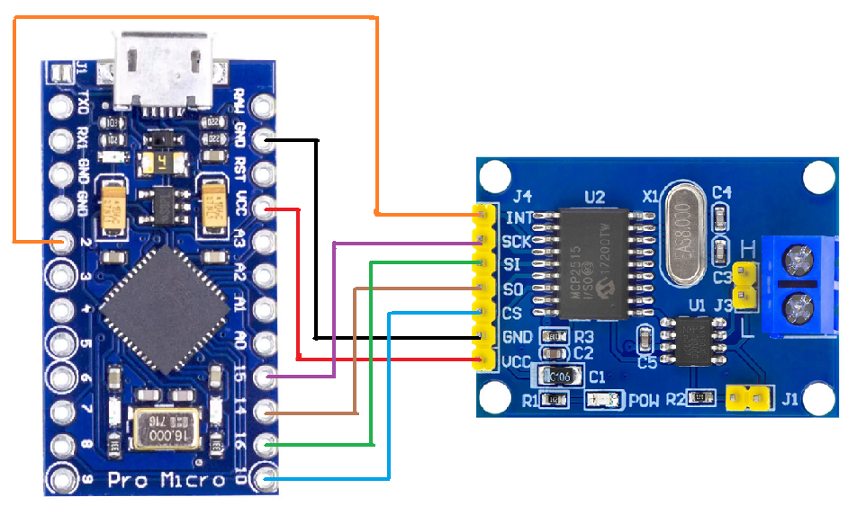
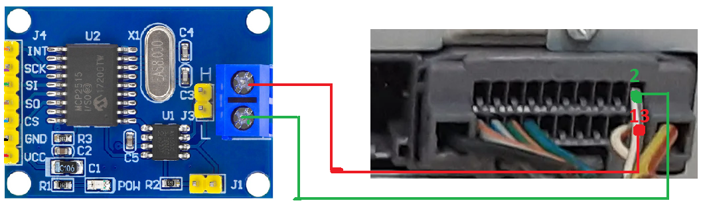
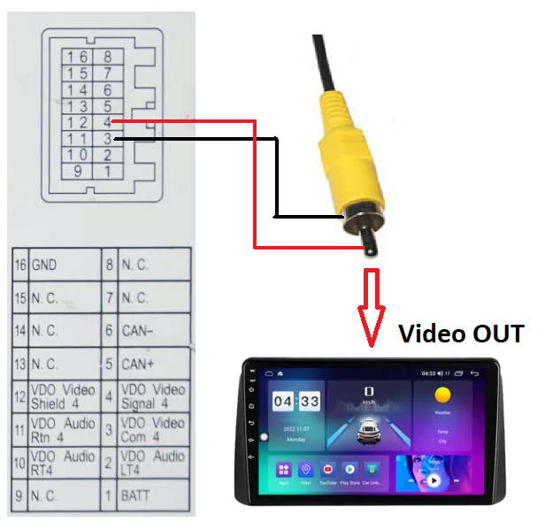
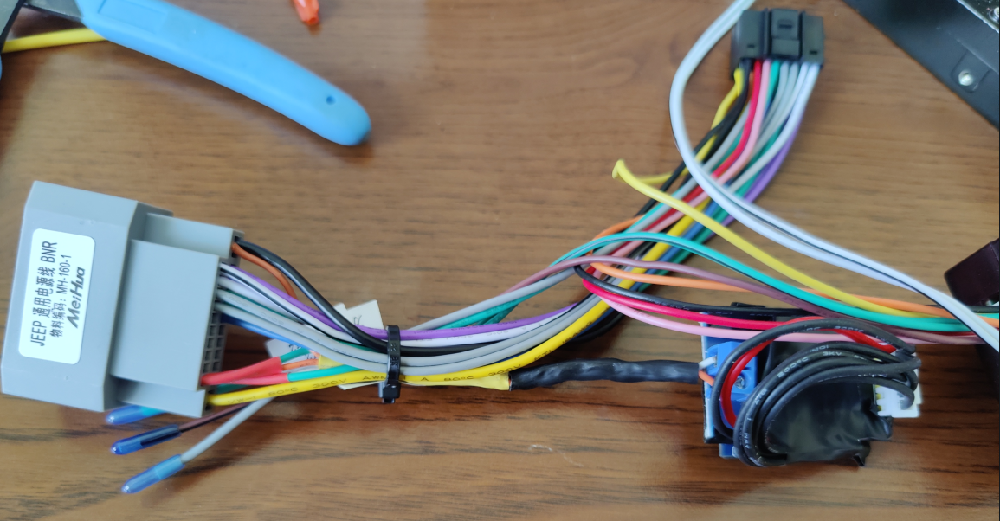
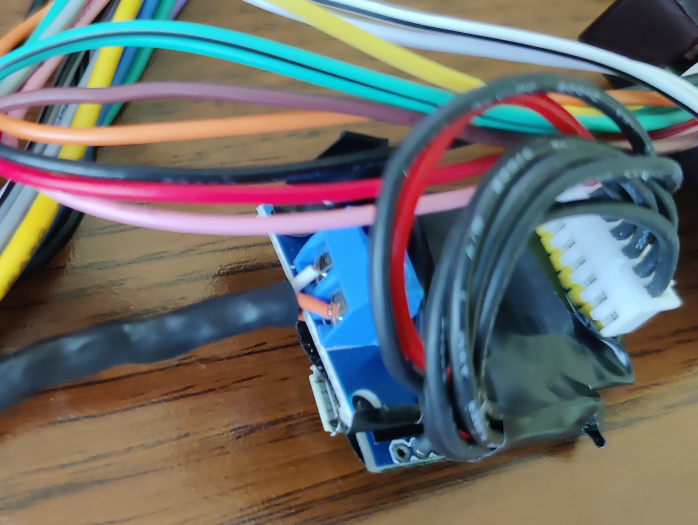
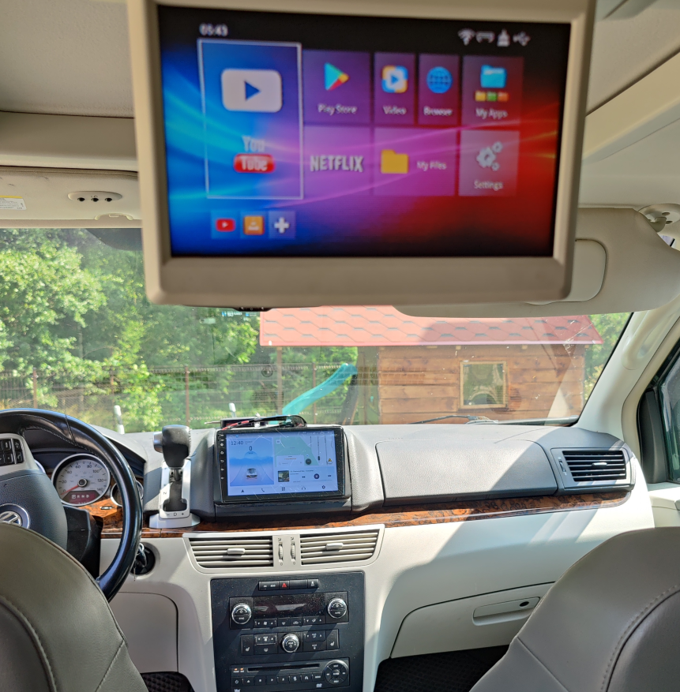

# Step by step guide

Following these steps you should have a working second row display working with any multimedia system.
This was only tested on VW Routan with MyGig NTG4 RHR radio, but it should work for other 
Chrysler based versions as well (Dodge Caravan, Lancia Voyager etc).

* Buy Arduino Pro Micro and MCP2515 CAN Bus Module
* Connect Arduino to MCP2515
  * 
* Flash Arduino with provided source code from [EnableVES.ino](src%2FEnableVES.ino)
  * Download Arduino IDE
  * Connect Arduino to PC via USB cable
  * In Arduino IDE Select Arduino Leonardo if not already selected
  * Install CAN library
    * Press on library icon in Arduino IDE
    * Search for 'Sandeep Mistry' and select CAN library
  * Press Upload button in Arduino IDE
  * If all goes well and there are no errors, Arduino should be ready to go
* Connect MCP2515 + and - to car multimedia CAN bus lane
  * 
* Connect Arduino to phone charger, multimedia USB or any other 5v source
* Connect Multimedia video OUT to VES DVD video OUT
  * Take out VES DVD player and cut off video signal (4) and video COM (3) wires
  * Connect video out signal from multimedia to VES video out
  * 
  * Connect VES DVD player back
  * Make sure there is any DVD in the DVD player, as it relies on VES DVD sending DVD info to displays.

And you are done. You should now see output from multimedia system on VES display.

End result:

This has worked for me, if you have a different original unit your mileage might vary - you might need to adjust the 
CANBUS codes.

### Connect Arduino to MCP2515:

|  Arduino  | MCP2515 |
|:---------:|:-------:|
|    VCC    |   VCC   |
|    GND    |   GND   |
| SCK (15)  |   SCK   |
| MISO (14) |   SO    |
| MOSI (16) |   SI    |
| A10 (10)  |   CS    |
|  SDA (2)  |   INT   |